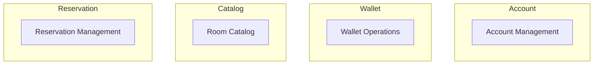
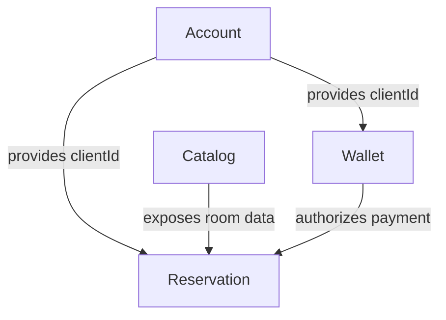

# Rendu

## Tactical Design

### Entities

* **Client** – created account of a person using the system.
* **Room** – lodging option available for reservation.
* **Reservation** – booking made by a client for a room and dates.
* **Payment** – money transfer linked to a reservation.
* **Wallet** – electronic wallet tied to a client and holding a balance.

### Value Objects

* **Money** – amount coupled with a currency.
* **Currency** – enumeration of the allowed currencies.
* **RoomType** – standard, superior or suite.

### How to run the code & tests

```bash
# data is stored in database.json in the project root
python3 -m venv venv
source venv/bin/activate
pip install -r requirements.txt

# initialize the JSON database
python3 main.py init-db

# run the automated tests
python3 -m unittest discover -s tests
```

## Strategic Design

> Please install [Markdown Preview Mermaid Support](https://marketplace.visualstudio.com/items?itemName=bierner.markdown-mermaid) to visualize the diagrams in VS Code.

### Ubiquitous language

* **Client** – person who can create an account and reserve rooms.
* **Account** – personal data containing full name, email and phone.
* **Wallet** – electronic wallet tied to a client; holds a balance in euros.
* **Currency** – allowed currencies: EUR, USD, GBP, JPY, CHF.
* **Room** – lodging option; standard, superior or suite with price per night.
* **Reservation** – booking of one or more rooms from a check-in date for a number of nights.
* **Payment** – debit from the wallet for a reservation.

### Bounded Contexts



### Context maps



### Core / Supporting / Generic domains

* **Core:** Reservation Management
* **Supporting:** Room Catalog, Wallet Operations
* **Generic:** Account Management
