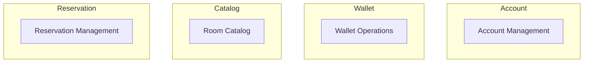
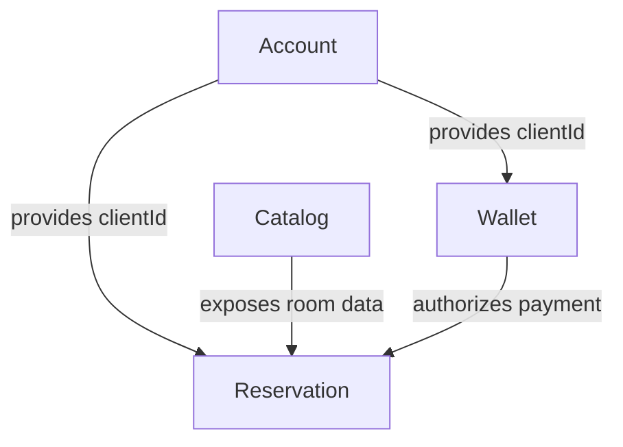

# Rendu

## Tactical Design

### Entities

* **Client** – person registered in the system. Holds contact details and a wallet balance.
* **Room** – lodging option available for reservation.
* **Reservation** – booking made by a client for a room and dates.
* **Payment** – record of a money transaction (deposit or booking balance).

### Value Objects

* **Money** – amount coupled with a currency.
* **Currency** – enumeration of the allowed currencies.
* **RoomType** – allowed room categories: standard, superior, suite and deluxe.

### How to run the code & tests

```bash
# data is stored in database.json in the project root
python3 main.py init-db         # initialize the JSON database

python3 -m unittest discover -s tests  # run the automated tests
```

## Strategic Design

> Please install [Markdown Preview Mermaid Support](https://marketplace.visualstudio.com/items?itemName=bierner.markdown-mermaid) to visualize the diagrams in VS Code.

### Ubiquitous language

* **Client** – person who can create an account and reserve rooms.
* **Account** – personal data containing full name, email and phone.
* **Wallet** – electronic wallet tied to a client; holds a balance in euros.
* **Currency** – allowed currencies: EUR, USD, GBP, JPY, CHF.
* **Room** – lodging option; types include standard, superior, suite and deluxe with price per night.
* **Reservation** – booking of one or more rooms from a check-in date for a number of nights.
* **Payment** – record of any wallet transaction (deposit or booking payment).

### Bounded Contexts



### Context maps



### Core / Supporting / Generic domains

* **Core:** Reservation Management
* **Supporting:** Room Catalog, Wallet Operations
* **Generic:** Account Management

## Preloaded rooms

`init-db` creates three rooms in the catalog:

* **Standard room** – 50€ per night
  * Single bed
  * Wifi
  * TV
* **Superior room** – 100€ per night
  * Double bed
  * Wifi
  * Flat screen TV
  * Minibar
  * Air conditioner
* **Suite** – 200€ per night
  * Double bed
  * Wifi
  * Flat screen TV
  * Minibar
  * Air conditioner
  * Bathtub
  * Terrace

The wallet balance is always stored in euros. A conversion will therefore be applied if a client pays in another currency.

## CLI commands

All features of the application are exposed through `main.py`:

```bash
python3 main.py init-db                    # initialize the database
python3 main.py add-client --name NAME --email EMAIL --phone PHONE
python3 main.py add-room --type TYPE --price PRICE --description TEXT
python3 main.py list-rooms                 # display all rooms
python3 main.py deposit --client ID --amount AMOUNT [--currency CUR]
python3 main.py reserve --client ID --room ID --check-in DATE --nights N
python3 main.py confirm --reservation ID
python3 main.py cancel --reservation ID
```

## Example commands with Tom

```bash
# initialize the database and rooms
python3 main.py init-db

# add a new deluxe room
python3 main.py add-room --type "deluxe" --price 250 \
    --description "King bed, jacuzzi, sea view"

# list all available rooms
python3 main.py list-rooms

# register Tom as a client
python3 main.py add-client --name "Tom" --email tom@example.com --phone 0600000000

# add funds to Tom's wallet in euros
python3 main.py deposit --client 1 --amount 500 --currency EUR

# Tom reserves the standard room for two nights starting on 2025-06-01
python3 main.py reserve --client 1 --room 1 --check-in 2025-06-01 --nights 2

# confirm the reservation
python3 main.py confirm --reservation 1

# Tom also books the deluxe room for three nights starting on 2025-06-10
python3 main.py reserve --client 1 --room 4 --check-in 2025-06-10 --nights 3

# cancel the second reservation
python3 main.py cancel --reservation 2
```
